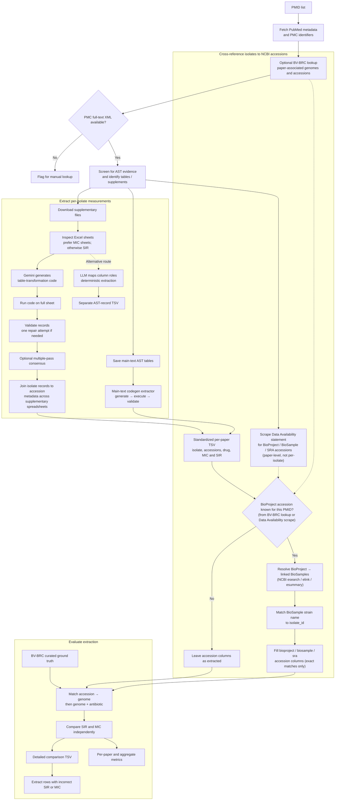

# Pipeline Overview

This diagram traces one PMID from the initial literature search through per-isolate AST
extraction, NCBI accession cross-referencing, and evaluation against BV-BRC ground truth.

## Notes on the accession cross-referencing step

- Implemented in `scripts/query_pmids_to_find_ast/match_isolates_to_biosample.py`.
- The BioProject accession going into node `Y` can come from either the BV-BRC genome lookup
  (`C`, usually the more reliable of the two since it's tied to an actual matched genome) or the
  Data Availability scrape (`DA`, paper-level text mining -- see
  `scripts/query_pmids_to_find_ast/README_ast_finder.md`'s note on
  `data_availability_accessions` for why that one needs a sanity check before trusting it blindly).
- Matching is strain-name based (NCBI BioSample's `strain`/`isolate` attribute vs. this
  pipeline's `isolate_id`), not accession-based -- there's no accession to match against until
  after this step runs. Only exact (case-insensitive, whitespace-normalized) matches get written
  back by default; `--apply` never overwrites an accession column that's already non-blank, which
  is why a supplement sheet that already had its own accessions (e.g. from a BV-BRC/PATRIC
  metadata sheet) is left untouched even when this step independently finds the same answer.
- This depends on live network access to `eutils.ncbi.nlm.nih.gov`, which isn't reachable from
  this repo's own sandboxed tooling -- it's meant to be run from a normal terminal, per PMID, as
  a follow-up pass after extraction rather than as part of the automated pipeline above.
